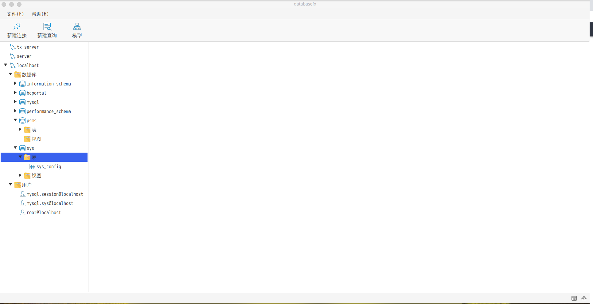
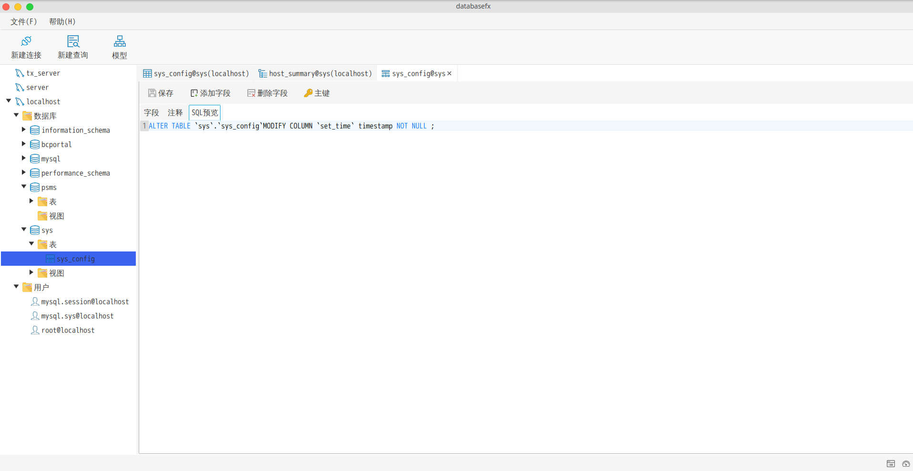

# databasefx

这是一个基于JavaFX和Vertx的免费、跨平台、开源的数据库管理工具。


## Build
在运行databasefx前请先执行以下命令：
```
gradlew build
```
运行databasefx执行以下命令:
```
gradlew run
```
注意 : databasefx 要求java版本大于或者等于14,由于jdk下载比较慢，推荐大家到[injdk](https://injdk.cn/)下载

## 应用快照
### 应用主界面

### 创建连接

### 数据库导航栏

### 设计表


### 导出数据

### SQL终端

### 鸣谢
## Thanks To

| Company              | For..                          |
|----------------------|--------------------------------|
| <a href="http://gluonhq.com"></a>| 为javafx的发展和改进提供了无限动力.|
|| 提供 <a href="https://www.jetbrains.com/idea">IntelliJ IDEA</a> 许可执照.|

